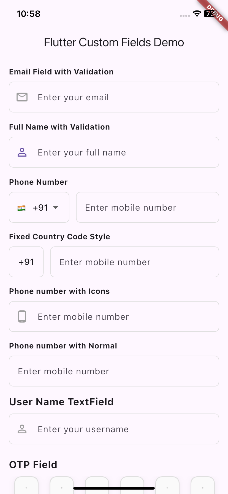
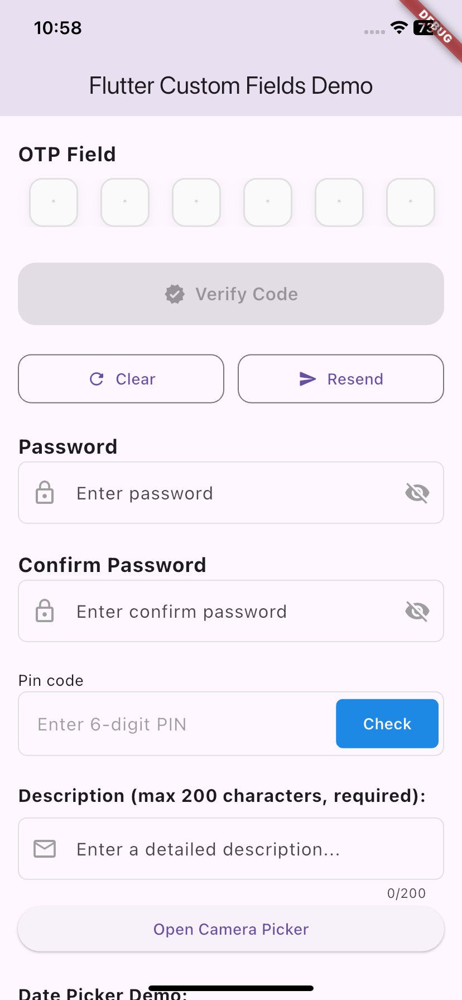
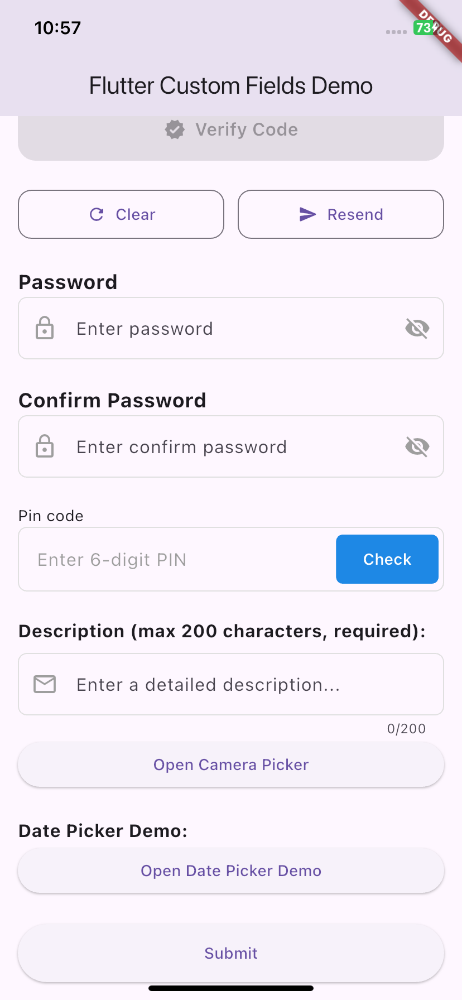

# 🧩 Flutter Custom TextFields

[](https://pub.dev/packages/flutter_custom_textfields)
[](https://opensource.org/licenses/MIT)

A Flutter package that provides customizable text fields with built-in validation for common input types. Features include email, phone number, username, full name, OTP, password, and confirm password fields with configurable validation and UI options.

## ✨ Features

- 📧 TextFields with leading icons for:
  - Email
  - Phone Number
  - Username
  - Full Name
  - OTP (4 digit)
  - Pin Code

- 🔒 TextFields with both leading and trailing icons for:
  - Password
  - Confirm Password

- 🔢 OTP Input with customizable length (4 digits)

- ✅ Built-in Regex-based validation for all input types

- 🧩 Easy integration and customization

## 🚀 Getting Started

Add this to your `pubspec.yaml`:
<!-- ```yaml -->
dependencies:
  flutter_custom_textfields: ^0.0.4

## 🛠️ How to Use

You can easily use pre-built custom text fields for various input types like:

Email
Username
Full Name
OTP
Phone Number
Password 
Confirm Password
Pin Code
To see how these fields are implemented and how they can be reused in real-time applications, explore the Example folder — especially the FormExample class. It demonstrates practical usage and integration in a complete form setup.

## 📸 Screenshots

Here's how some of the custom text fields look in a sample form:



